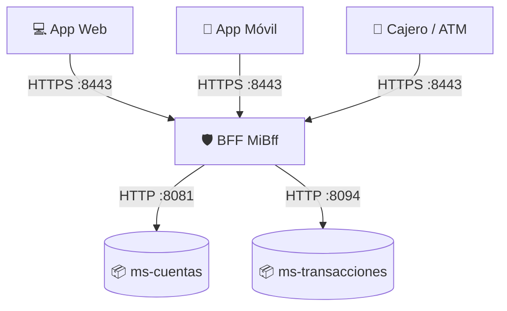

# xyz_bank_bff

Aplicación basada en microservicios que implementa el patrón de diseño **Backend-For-Frontend (BFF)**. Está diseñada para orquestar y adaptar respuestas desde microservicios backend hacia diferentes canales de clientes (Web, Móvil y Cajeros Automáticos/ATM) de manera eficiente y segura.

## 🏗️ Arquitectura del Sistema

El ecosistema se compone de tres microservicios principales:

1. **MiBff (Gateway / Agregador - Puerto 8443):**
   Actúa como punto de entrada único (con seguridad TLS/SSL) para los clientes. Orquesta llamadas concurrentes hacia los microservicios y adapta las respuestas (DTOs) según las necesidades específicas de la interfaz de usuario que realiza la solicitud.
2. **ms-cuentas (Backend - Puerto 8081):**
   Microservicio encargado del dominio de Cuentas. Persistencia gestionada en base de datos H2 en memoria con precarga de datos desde archivos CSV (`intereses.csv`).
3. **ms-transacciones (Backend - Puerto 8094):**
   Microservicio encargado del dominio de Transacciones. Persistencia en H2 y precarga de historial mediante CSV (`cuentas_anuales.csv`).



## ✨ Características Principales

- **Patrón BFF por Canal:** Exposición de endpoints diferenciados (`/api/web/`, `/api/movil/`, `/api/cajero/`) que retornan estrictamente los datos que cada interfaz necesita (por ejemplo, la app móvil solo recibe los últimos 5 movimientos, mientras que la web recibe un resumen detallado y cálculos de ingresos/egresos).
- **Procesamiento Concurrente:** Uso de `CompletableFuture` y un `ExecutorService` de tamaño fijo en el `AgregadorService` para realizar llamadas en paralelo a los microservicios `ms-cuentas` y `ms-transacciones`, optimizando drásticamente los tiempos de respuesta.
- **Seguridad Robusta:**
  - **Transporte:** Encriptación TLS/SSL (HTTPS) mediante Keystore (`bff-keystore.p12`).
  - **Autenticación y Autorización:** Spring Security con `Basic Auth` y control de acceso basado en roles (`ROLE_WEB`, `ROLE_MOVIL`, `ROLE_CAJERO`).
- **Resiliencia REST:** Implementación nativa de `RestClient` (Spring 3.2+) configurado con tiempos de espera estrictos (`connect-timeout` y `read-timeout`) a través de `SimpleClientHttpRequestFactory`.

## 🛠️ Tecnologías Utilizadas

- **Lenguaje:** Java 21
- **Framework Core:** Spring Boot
- **Base de Datos:** H2 (In-Memory)
- **Persistencia:** Spring Data JPA
- **Seguridad:** Spring Security
- **Cliente HTTP:** Spring `RestClient`
- **Utilidades:** Lombok

## 🚀 Guía de Inicio Rápido

### Prerrequisitos
- JDK 21 instalado.
- Apache Maven instalado.

### Pasos para ejecutar

1. **Iniciar el Microservicio de Cuentas (`ms-cuentas`):**
   ```bash
   cd ms-cuentas
   ./mvnw spring-boot:run
   ```
   Estará disponible en `http://localhost:8081`.

2. **Iniciar el Microservicio de Transacciones (`ms-transacciones`):**
   ```bash
   cd ms-transacciones
   ./mvnw spring-boot:run
   ```
   Estará disponible en `http://localhost:8094`.

3. **Iniciar el Backend-For-Frontend (`MiBff`):**
   ```bash
   cd MiBff
   ./mvnw spring-boot:run
   ```
   Estará disponible en `https://localhost:8443`.

## 🔒 Credenciales de Prueba (Basic Auth)

El BFF está protegido mediante roles específicos para cada canal. Utiliza las siguientes credenciales para probar los endpoints:

| Canal | Usuario | Contraseña | Rol Requerido |
|-------|---------|------------|---------------|
| **Web** | `clienteWeb` | `web123` | `WEB` |
| **Móvil** | `clienteMovil` | `movil123` | `MOVIL` |
| **Cajero (ATM)** | `atmXyz` | `atm123` | `CAJERO` |

## 📡 Endpoints del BFF

### 1. Canal Web (Resumen detallado)
**GET** `https://localhost:8443/api/web/cuentas/{id}`
- **Auth:** Basic (`clienteWeb` / `web123`)
- **Respuesta:** Detalle completo de la cuenta, lista íntegra de movimientos y un resumen calculado (total ingresos, total egresos, saldo neto).

### 2. Canal Móvil (Vista simplificada)
**GET** `https://localhost:8443/api/movil/cuentas/{id}`
- **Auth:** Basic (`clienteMovil` / `movil123`)
- **Respuesta:** Saldo actual y únicamente los **últimos 5 movimientos** optimizados para renderizado en pantallas pequeñas.

### 3. Canal Cajero Automático (Operación rápida)
**GET** `https://localhost:8443/api/cajero/cuentas/{id}/saldo`
- **Auth:** Basic (`atmXyz` / `atm123`)
- **Respuesta:** Consultas ultra-rápidas directas al saldo actual, sin consultar el historial de transacciones.

---
